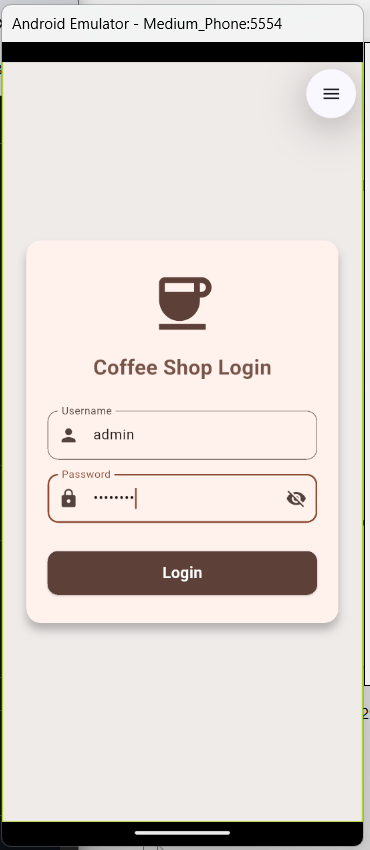
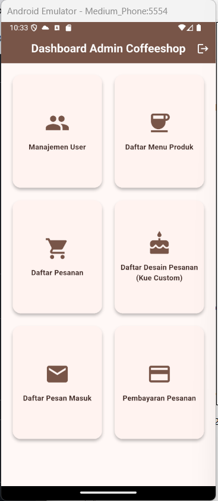

# ☕ Flutter Coffee Shop App

Sistem Manajemen Pemesanan & Kasir (Point of Sale) Coffee Shop berbasis mobile menggunakan framework **Flutter** yang dilengkapi dengan manajemen menu, multi-item order, pencatatan transaksi pembayaran, upload desain kustom pesanan, manajemen pengguna, serta pengiriman pesan kontak.

---

## 📖 Tentang Aplikasi

Aplikasi **Flutter Coffee Shop** dirancang untuk memudahkan operasional kafe dalam mengelola alur bisnis harian:
1. Membantu kasir mencatat pesanan pelanggan secara cepat dan akurat.
2. Memfasilitasi pesanan khusus (custom order) dengan fitur upload foto/desain referensi.
3. Menghitung total belanja, pembayaran tunai, dan uang kembalian secara otomatis.
4. Terintegrasi dengan database lokal (SQLite) serta arsitektur backend REST API (Spring Boot + MySQL) untuk sinkronisasi data transaksi.

---

## 📷 Dokumentasi & Demo

Berikut adalah visualisasi antarmuka aplikasi Flutter pada emulator Android:

| Fitur | Tampilan Dokumentasi | Deskripsi |
| :--- | :---: | :--- |
| **Halaman Login** |  | Halaman autentikasi login pengguna dengan validasi akun serta form input username dan password. |
| **Dashboard Admin** |  | Tampilan menu utama (dashboard) untuk mengakses seluruh modul operasional Coffee Shop (Manajemen User, Menu Produk, Daftar Pesanan, Desain Pesanan Kue Custom, Pesan Masuk, dan Pembayaran). |

> [!TIP]
> Tangkapan layar antarmuka aplikasi tersimpan di folder `docs/screenshots/` dan siap ditampilkan secara otomatis saat repositori dibuka di GitHub.

---

## ✨ Fitur Utama

- 🔐 **Autentikasi & Multi-Role Pengguna**:
  - Login dengan autentikasi berbasis pengguna (`Admin` & `Kasir`).
  - Manajemen user (Tambah, Ubah, Hapus akun kasir/admin).
  - *Session Protection*: Proteksi sesi otomatis saat aplikasi diminimalkan (background).

- 📋 **Katalog & Manajemen Menu Produk**:
  - Tampilan daftar menu kopi, non-kopi, dan camilan/snack.
  - CRUD Menu (Create, Read, Update, Delete produk beserta harga, kategori, dan deskripsi).

- 🛒 **Pencatatan Pesanan (Point of Sale)**:
  - Pembuatan tiket pesanan dengan multi-item menu.
  - Perhitungan otomatis subtotal per menu dan total harga akumulatif.
  - Pelacakan status pesanan (*Pending*, *Diproses*, *Selesai*).

- 💳 **Kasir & Konfirmasi Pembayaran**:
  - Halaman kasir untuk validasi nominal pembayaran tunai pelanggan.
  - Kalkulasi instan untuk jumlah uang kembalian.
  - Konfirmasi status pelunasan transaksi pesanan.

- 🎨 **Desain Custom Pesanan**:
  - Fitur pemesanan khusus bagi pelanggan (misal: custom latte art, topper cake khusus, atau kemasan hampers).
  - Integrasi kamera & galeri (`image_picker`) untuk mengunggah foto desain/referensi.
  - Catatan instruksi khusus untuk barista/dapur.

- ✉️ **Pesan Masuk & Kontak**:
  - Formulir kirim feedback, kritik, saran, atau pertanyaan dari pelanggan.
  - Dashboard pesan kontak masuk untuk pengelola.

---

## 🛠 Tech Stack & Dependencies

- **Frontend / Client**: [Flutter](https://flutter.dev/) (Dart 3.x)
- **Local Storage / Persistence**:
  - `sqflite`: Penyimpanan basis data relasional offline-first
  - `shared_preferences`: Manajemen sesi pengguna & status navigasi
- **Device Features**:
  - `image_picker`: Akses galeri dan kamera untuk upload foto desain
  - `url_launcher`: Membuka tautan eksternal
- **Backend / API (Opsional / Integrasi)**:
  - Java Spring Boot REST API
  - MySQL (`ta_db_coffeeshop`) dikelola via HeidiSQL / phpMyAdmin

---

## 🚀 Panduan Menjalankan Proyek

### 1. Menjalankan di Android Studio (Emulator)

1. Buka software **Android Studio**.
2. Buka menu **Tools** > **Device Manager** (atau klik ikon ponsel di toolbar samping kanan).
3. Pada daftar Virtual Device, klik tombol **Play** (▶️) pada emulator pilihan Anda (misalnya `Medium Phone API 36` atau `Pixel`).
4. Tunggu beberapa detik hingga sistem Android pada emulator menyala dan masuk ke layar beranda (*Home Screen*).
5. Buka proyek ini di Android Studio atau VS Code.
6. Pada *Device Selector* (dropdown perangkat), pilih nama emulator yang sedang berjalan.
7. Tekan tombol **Run** (ikon segitiga hijau ▶️) atau tekan shortcut `Shift + F10` (Android Studio) / `F5` (VS Code).

---

### 2. Menjalankan via Terminal / CLI

Pastikan Flutter SDK sudah terpasang dan dikenali di PATH sistem Anda.

1. **Unduh Dependensi**:
   ```bash
   flutter pub get
   ```

2. **Cek Perangkat yang Aktif**:
   ```bash
   flutter devices
   ```
   *Contoh output yang menunjukkan emulator siap:*
   ```text
   sdk gphone64 x86 64 (mobile) • emulator-5554 • android-x64 • Android 16 (API 36)
   ```

3. **Jalankan Aplikasi ke Emulator**:
   ```bash
   flutter run -d emulator-5554
   ```
   *(Atau cukup ketik `flutter run` jika hanya ada satu perangkat emulator aktif)*.

4. Tunggu hingga proses build `assembleDebug` selesai dan aplikasi muncul di layar emulator.

---

### 3. Perintah Kontrol Saat Running (Hot Reload)

Ketika aplikasi sedang berjalan melalui terminal, gunakan tombol berikut:
- **`r`** (huruf kecil) : **Hot Reload** (memperbarui perubahan kode UI secara instan tanpa restart).
- **`R`** (huruf kapital) : **Hot Restart** (mereset state dan menjalankan ulang aplikasi dari awal).
- **`h`** : Menampilkan daftar bantuan shortcut di terminal.
- **`q`** : Menghentikan aplikasi yang sedang berjalan.

---

### 4. Build APK Release

Untuk menghasilkan file APK siap pasang di perangkat fisik Android:
```bash
flutter build apk --release
```
File APK keluaran akan tersimpan di:
```text
build/app/outputs/flutter-apk/app-release.apk
```

---

## 🔑 Akun Demo & Akses

| Role | Username | Password Default | Keterangan |
| :--- | :--- | :--- | :--- |
| **Admin** | `admin` | `admin123` | Akses 

*(Kredensial dapat disesuaikan atau didaftarkan melalui menu registrasi/manajemen user pada aplikasi).*
